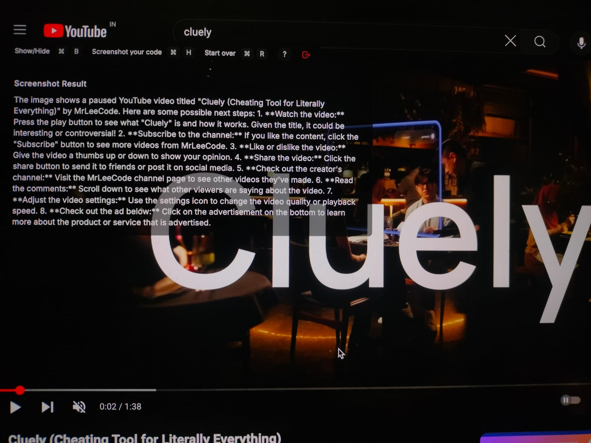

# Reverse-Engineering "Invisible Cheating App" Cluely

Everyone saw Roy Lee's viral stunt with "Cluely," the invisible app designed to secretly ace coding interviews. He pissed off Columbia, Amazon, and pretty much everyone else—but let's skip past the controversy. I tore apart the app to see how it works, and turns out, the tech itself is genuinely interesting.



### How Cluely Actually Works (Technical Breakdown)

Roy built Cluely using Electron, a desktop app framework based on Chromium and Node.js, to create a transparent, always-on-top overlay:

- **Transparent Window (**`transparent: true`**)** – This Electron BrowserWindow property ensures the background is fully transparent, showing only explicitly rendered content.
- **Always On Top (**`alwaysOnTop: true`**)** – Electron's flag forces the overlay window to persistently float above all other applications, making it consistently accessible without being covered.

Here's an example code snippet: 

```
const { BrowserWindow } = require('electron');

const win = new BrowserWindow({
  width: 800,
  height: 600,
  transparent: true,
  frame: false,
  alwaysOnTop: true,
  skipTaskbar: true,
  resizable: false,
  fullscreen: false,
  webPreferences: {
    nodeIntegration: true,
    contextIsolation: false,
  }
});
win.loadURL('file://' + __dirname + '/index.html');
```

### Backend Communication

The overlay captures clipboard data, screenshots, or selected text and sends this information to an AI backend (e.g., OpenAI) via WebSockets or HTTP requests. This backend quickly processes and returns useful suggestions or solutions.

### Screen Capture and OCR

Advanced implementations use native modules (like node-ffi, robotjs) to capture specific screen areas and run OCR (Optical Character Recognition) using libraries like Tesseract.js. This lets the overlay extract text directly from your screen.

### Clipboard Monitoring

Electron continuously listens for clipboard changes, immediately activating AI-assisted processing whenever new text is copied.

### But Here's the Catch

- **Security Annoyances**: macOS and Windows can detect and restrict invisible overlays in secure or fullscreen contexts.
- **Performance Drag**: OCR processes and constant clipboard monitoring can significantly increase CPU and GPU usage.

### Real, Ethical Ways to Use This Tech

Roy was trolling interviews, but here's the thing—this invisible overlay tech is actually super useful:

- **Sales Copilots**: Imagine having a "Wolf of Wall Street"-style playbook always ready—instantly giving your sales reps real-time context and powerful closing lines during calls or meetings.
- **Customer Support Assistant**: Like having Jarvis from Iron Man whispering the perfect response into your ear—automatically suggesting accurate and relevant replies without breaking your workflow.
- **Onboarding Buddy**: Give new employees a personalized overlay that pops up helpful, contextual advice exactly when they need it, helping them get productive faster and more comfortably.

### Want to Use This for Good?

Everything's open-sourced right [here](https://github.com/Prat011/free-cluely). If this sounds like something your team could use ethically and effectively, reach out. Let's build something legit. You can contact me at prathit3.14@gmail.com